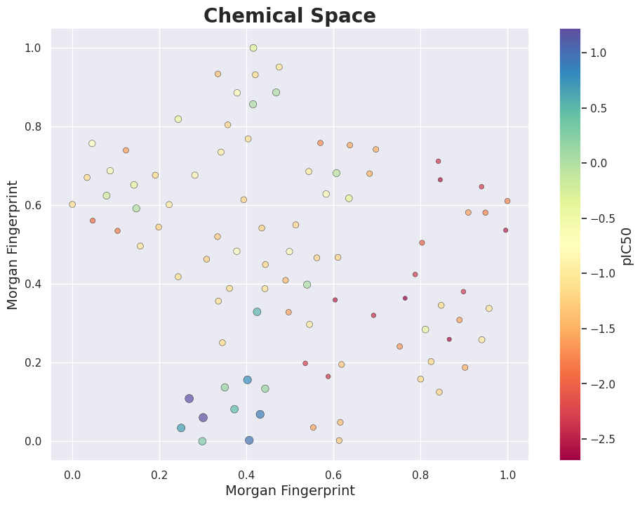

# Chemical Space 

This repository contains all the projects related to Chemical Space Analysis.

---

## 1. Molecular Similarity in a Chemical Space

Script adapted and developed to plot the molecular similarity in a chemical space.

If you are interested on this code click here >> [Chemical Space](/simple_chemical_space/)

*All information about this code is presented on its own [README.md](simple_chemical_space/README.md)*

&nbsp;

  

&nbsp;
&nbsp;

## 2. Chemical Space Grid

Script adapted and developed to plot the molecular similarity in a chemical space grid.

If you are interested on this code click here >> [Chemical Space](/grid_chemical_space/)

*All information about this code is presented on its own [README.md](grid_chemical_space/README.md)*

&nbsp;

---
## Authorship

* Author: **Brenda Ferrari** ([brendaferrari](https://github.com/brendaferrari))

Social preview original photo by **Brenda Ferrari** ([brendaferrari](https://github.com/brendaferrari))