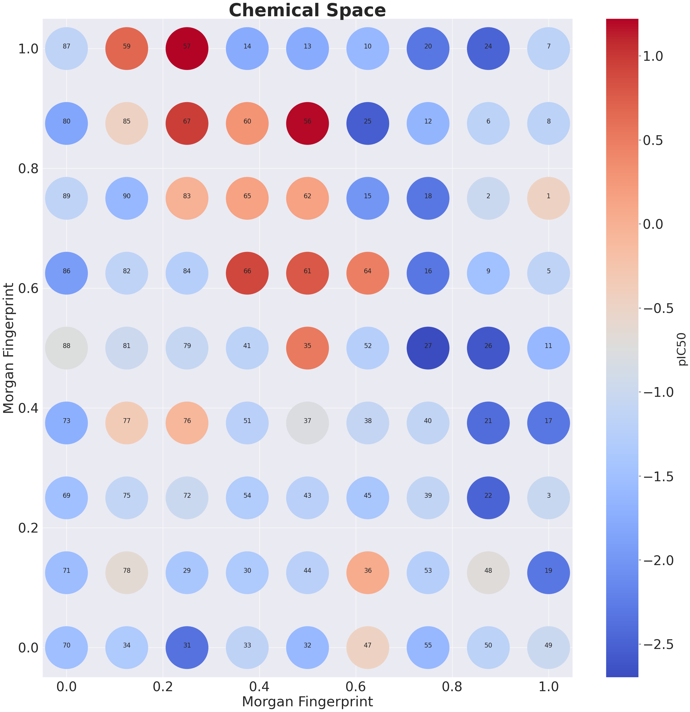

## Chemical Space Grid

Script adapted and developed to plot the molecular similarity in a chemical space grid.



This script has been adapted from [iwatobipen](https://gist.github.com/iwatobipen/f8b0e8ea2c872e7ccf34ab472454ce6c#file-chemicalspace_lapjv-ipynb), according to the papper written by [Atsushi Yoshimori et.al](https://pubs.acs.org/doi/pdf/10.1021/acsomega.9b00595). 

I strongly advise to check [iwatobipen github](https://github.com/iwatobipen) and [blog](https://iwatobipen.wordpress.com/) if you are interested on chemical space, chemical similarity and other cheminformatics topics.

## Libraries used

* [pandas](https://pandas.pydata.org/) - a Python package that provides fast, flexible, and expressive data structures designed to make working with "relational" or "labeled" data both easy and intuitive. 

* [NumPy](https://numpy.org/) -  the fundamental package for array computing with Python

* [RDKit](https://www.rdkit.org/) - Open source toolkit for cheminformatics

* [scikit-learn](https://scikit-learn.org/stable/) - Machine Learning in Python.

* [Matplotlib](https://matplotlib.org/) - a comprehensive library for creating static, animated, and interactive visualizations in Python.

* [seaborn](https://seaborn.pydata.org/) - a Python data visualization library based on matplotlib.  

* [SciPy.org](https://www.scipy.org/) - a Python-based ecosystem of open-source software for mathematics, science, and engineering. 

* [pyLAPJV](https://github.com/src-d/lapjv) - Linear Assignment Problem solver using Jonker-Volgenant algorithm. 


Libraries were used in a [Miniconda3](https://docs.conda.io/en/latest/miniconda.html) environment using python 3.6.13, with exception of pyLAPJV. 

## Instalation

Miniconda3: [Installation](https://conda.io/projects/conda/en/latest/user-guide/install/index.html)

pandas:
```
conda install -c anaconda pandas
```
numpy
```
conda install -c anaconda numpy
```
RDKit
```
conda install -c rdkit rdkit
```
scikit-learn
```
conda install -c anaconda scikit-learn
```
Matplotlib
```
conda install -c conda-forge matplotlib
```
seaborn
```
conda install -c anaconda seaborn
```
SciPy.org
```
conda install -c anaconda scipy
```
pyLAPJV (pip install)
```
pip3 install lapjv
```

## How to use

* Download the code and unzip it on the desirable directory

To run use the following command:
```
python chemical_space.py
```

## Observations

**This script has been elaborated using as references the following articles and codes:**

* [Visualize chemical space as a grid](https://iwatobipen.wordpress.com/2019/08/27/visualize-chemical-space-as-a-grid-chemoinformatics-rdkit/) - [code](https://gist.github.com/iwatobipen/f8b0e8ea2c872e7ccf34ab472454ce6c#file-chemicalspace_lapjv-ipynb)

**The dataset used as example was made publically available by the Government of India as a part of their Drug Discovery Hackathon and is found at the following link:**

* [COVID-19 Drug Discovery Data](https://www.kaggle.com/divyansh22/drug-discovery-data?select=DDH+Data.csv)

## Authorship

* Author: **Brenda Ferrari** ([brendaferrari](https://github.com/brendaferrari))

Social preview original photo by **Brenda Ferrari** ([brendaferrari](https://github.com/brendaferrari))